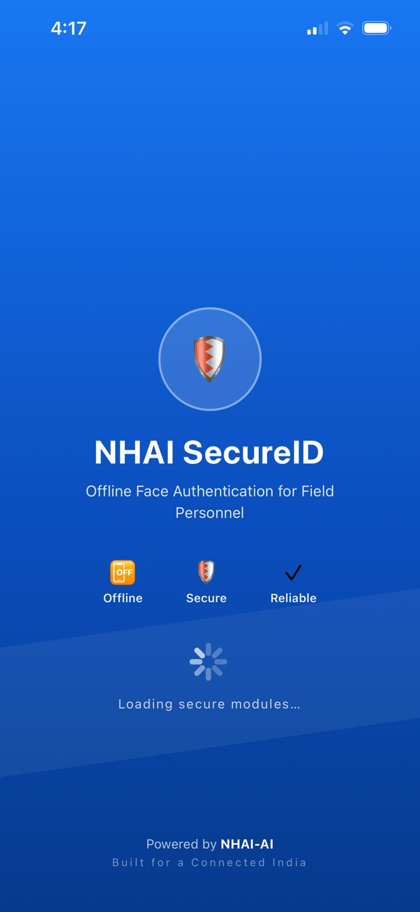
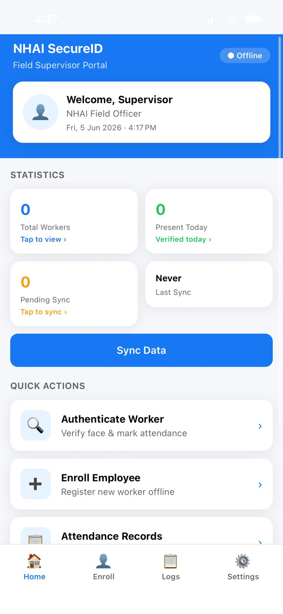
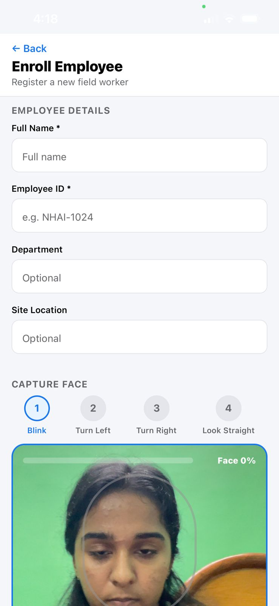
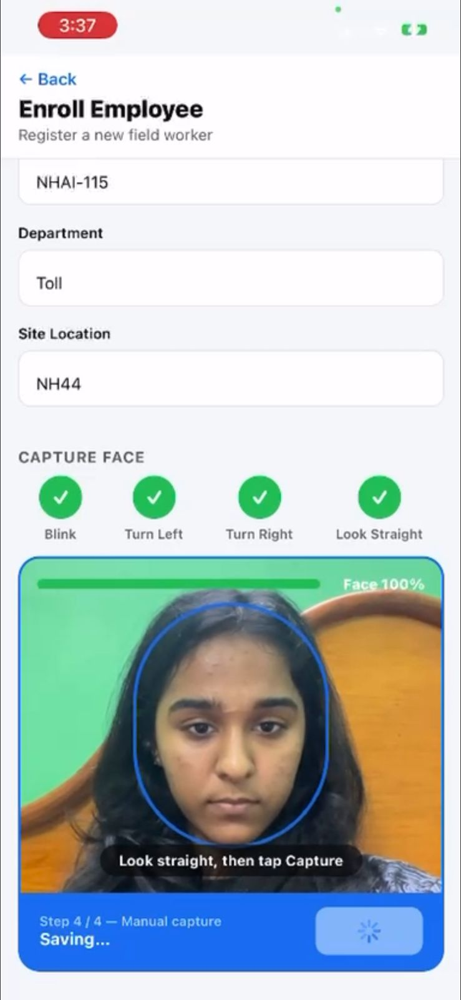
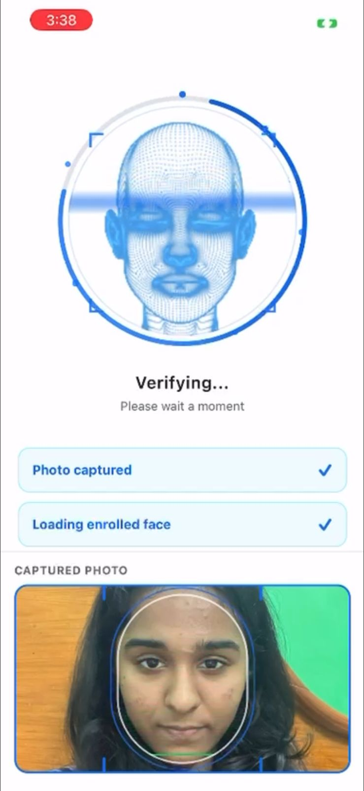
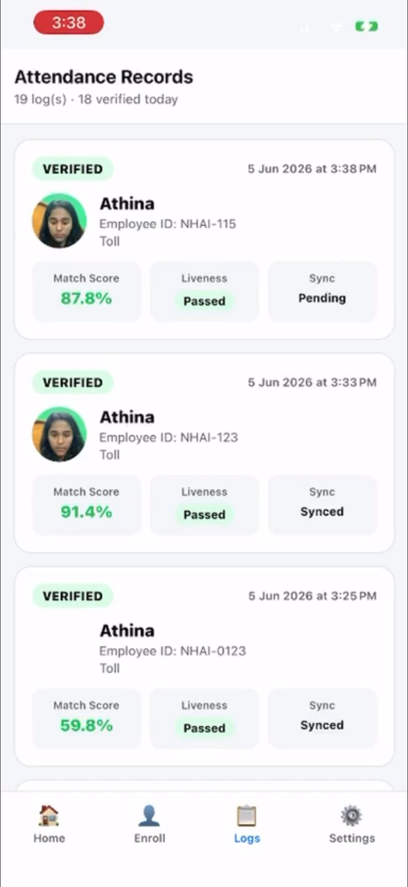

# NHAI SecureID – Offline Facial Authentication System for Remote Operations

A fully offline, edge AI-powered face authentication and attendance system with anti-spoofing,
liveness detection, and cloud sync capability for secure and efficient biometric authentication in remote environments.

## Team Details 
### Team Title
 **MetriX**
 **[ Precision AI Solutions for Real-World Challenges ]**
 
### Contributors 

 - **ROSHAN PATEL** - System Architecture & Solution Design
 - **BK ATHINA** - Frontend Development & UI/UX Design
 - **HANISHA GOVINDARAJ** - Integration and Documentation
 - **NITHEESH S** - AI Research and Model Selection
 - **VIPUL RAJ SHAH** - AI Model Training and Optimization

 

## Project Proposal & Documentation

- [Project Proposal Document](https://drive.google.com/file/d/1QHi7vjjb1-VKTbFL4a-rizmfZnsIZ25h/view?usp=drive_link)

## Project Screenshots & Video Links

**NHAI SecureID**

<table>
  <tr>
    <td align="center">
       
      <strong>1. Splash</strong>
    </td>
    <td align="center">
       
      <strong>2. Login</strong>
    </td>
    <td align="center">
       
      <strong>3. Dashboard</strong>
    </td>
    <td align="center">
       
      <strong>4. Enrollment</strong>
    </td>
    <td align="center">
       
      <strong>5. Verification</strong>
    </td>
  </tr>
  <tr>
    <td align="center">
       
      <strong>6. Enrolled</strong>
    </td>
    <td align="center">
       
      <strong>7. Attendance</strong>
    </td>
    <td align="center">
       
      <strong>8. Verification</strong>
    </td>
    <td align="center">
       
      <strong>9. Approve</strong>
    </td>
    <td align="center">
       
      <strong>10. Records</strong>
    </td>
  </tr>
</table>

### Live Demo

[NHAI SecureID Demo Video link](https://drive.google.com/file/d/1i5pEl9GFcMXz55crCaSI56OVVqh91EXF/view?usp=sharing)

## Problem Statement & Research Insights

The problem statement focuses on developing a secure, lightweight, and fully offline facial recognition and liveness detection system for authenticating field personnel in remote and zero-network environments. The solution must operate efficiently on standard mid-range mobile devices, provide authentication in less than one second, achieve more than 95% accuracy, and integrate seamlessly with the existing Datalake 3.0 . The system should also include anti-spoofing measures, encrypted local storage, and offline-to-online synchronization capability.

## Solution Approach 

NHAI SecureID is a lightweight offline facial recognition and liveness detection system developed for secure field personnel authentication in remote and zero-network environments. The solution uses MediaPipe Face Detection, MiniFASNet Anti-Spoofing, Blink Verification, and MobileFaceNet-based facial recognition to provide fast and accurate identity verification on standard mobile devices. Optimized TensorFlow Lite (.tflite) models ensure sub-second authentication with a compact AI footprint under 20 MB. Built using React Native, the application supports Android and iOS, stores encrypted facial embeddings locally using SQLite, and includes offline attendance logging with AWS sync and purge capability for seamless integration with Datalake 3.0.

For more solution details visit : [NHAI SecureID Solution Documentation](./docs/NHAI_SecureID_Solution.pdf)

## Project Demo

  

## System Workflow Summary

<image src="./docs/images/system_workflow.png" alt="system workflow summary diagram" width="100%" />

# Tech Stack & Reasoning
| Layer                         | Technology                         | Purpose / End Use                                                                       |
| ----------------------------- | ---------------------------------- | --------------------------------------------------------------------------------------- |
| Mobile App Framework          | React Native SDK 54                | Cross-platform mobile application development for Android and iOS                       |
| Camera & Real-time Processing | react-native-vision-camera         | Captures live video stream for face detection and authentication pipeline               |
| On-device AI Inference        | react-native-fast-tflite           | Runs optimized ML models directly on mobile devices without cloud dependency            |
| Face Detection                | MediaPipe                          | Detects facial landmarks and ensures proper face alignment and quality validation       |
| Anti-Spoofing Model           | MiniFASNet                         | Detects fake face attempts using images, videos, or masks                               |
| Face Recognition Model        | MobileFaceNet                      | Generates 512-D face embeddings for identity matching                                   |
| Local Database                | SQLite                             | Stores attendance records and face embeddings securely on device                        |
| Security Layer                | AES Encryption                     | Encrypts biometric embeddings for secure local storage                                  |
| Cloud Sync                    | AWS Sync Layer                     | Syncs offline attendance data to cloud when network becomes available                   |
| Model Optimization            | Quantization, Pruning, Compression | Reduces model size and improves inference speed for mobile deployment (<20MB footprint) |

# System Design & Workflow 

<image src="./docs/images/face_authentication_workflow.jpeg" alt="system architecture diagram" width="96%" height="700px" />

 

<image src="./docs/images/enrollment_workflow.jpeg" alt="enrollment workflow diagram" style="width:48%;height:500px;object-fit:contain;" />
<image src="./docs/images/authentication_workflow.jpeg" alt="authentication workflow diagram" style="width:48%;height:500px;object-fit:contain;" />

## Key Features & Functionalities

1. Fully Offline Facial Authentication System designed for zero-network and remote field environments.
2. AI-powered Face Recognition using MobileFaceNet for fast and accurate employee verification.
3. Multi-layer Security Architecture including MiniFASNet Anti-Spoofing and Active Liveness Detection (Blink, Smile, Head Turn Verification).
4.	Lightweight Edge AI Models optimized using Quantization and TensorFlow Lite (.tflite) conversion with total model size under ~20 MB.
5. Real-time Authentication in less than 1 second on standard mid-range Android and iOS devices without GPU dependency.
6. Encrypted Local Face Embedding Storage using SQLite to ensure privacy and secure offline identity verification.
7. Offline Attendance Logging with Sync & Purge mechanism for automatic AWS synchronization when internet connectivity is restored.
8. Cross-platform React Native Integration with modular plugin-based architecture for seamless deployment into Datalake 3.0 and other enterprise applications.

# Future Scope & Scalability
1) **Thermal Core Integration** 
Adding support for companion thermal imaging hardware to track core body heat alongside face authentication for physical access checkpoints.
2) **On-Device Continuous Learning**  
Upgrading edge model components to subtly adapt local face embeddings over time, accounting for natural employee aging or facial hair growth without cloud re-training.
3) **Predictive Offline Sync Scheduling**  
Embedding machine learning algorithms to predict local network restoration patterns, scheduling uploads during optimal signal windows to preserve mobile battery health.
4) **Multi-Model Biometric Expansion**  
Extend the system beyond facial recognition by integrating additional on-device biometric signals such as voice recognition or gait analysis, enabling stronger multi-factor authentication in high-security zones without increasing hardware dependency.

## Conclusion
We hereby declare that the proposed solution, NHAI SecureID delivers a robust, lightweight, and fully offline AI-based facial authentication system tailored for remote highway workforce verification. With its edge AI architecture, encrypted biometric storage, and sub-second processing, it ensures high accuracy and reliability in zero-network environments. Its modular, plugin-based SDK design enables seamless integration with Datalake 3.0 without major system changes. Combined with secure offline-to-online sync and scalable architecture, this solution is a practical, future-ready, and highly efficient choice for nationwide deployment.
