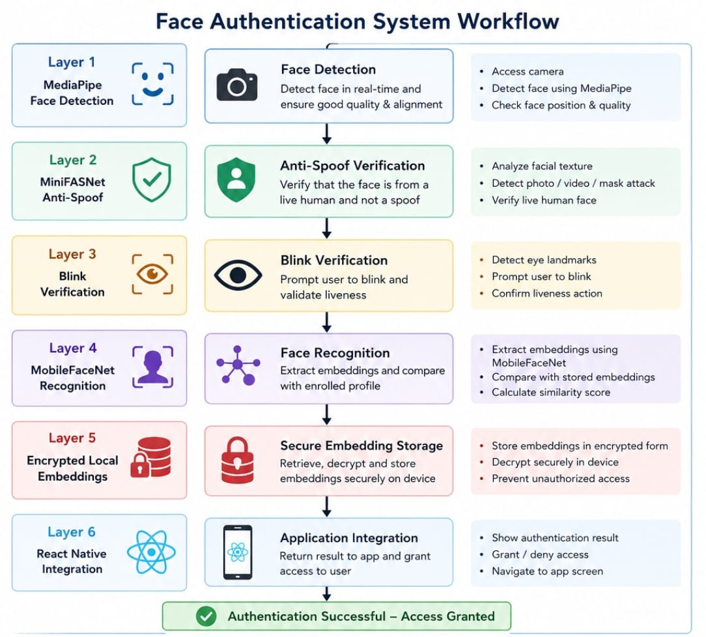
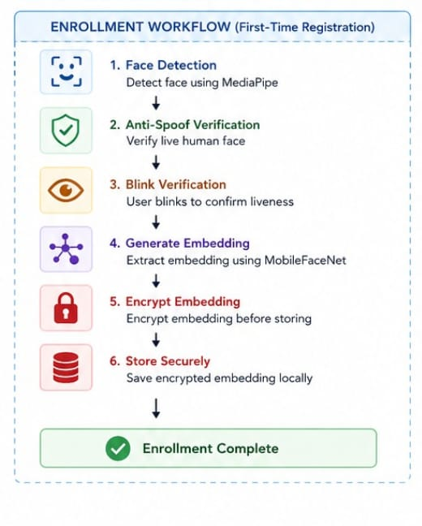
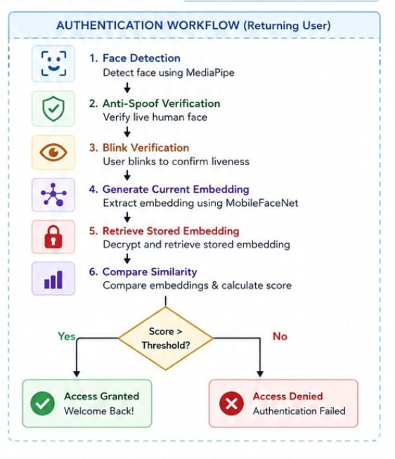

# NHAI SecureID – Offline Facial Authentication System for Remote Operations

A fully offline, edge AI-powered face authentication and attendance system with anti-spoofing,
liveness detection, and cloud sync capability

# Team Details 
## Team Name 
 MetriX
 
## Contributers 
 BK ATHINA 

 ROSHAN PATEL 

 VIPUL RAJ SHAH

 NITHEESH S
 
 HANISHA GOVINDARAJ

# Problem Statement & Research Insights
Modern biometric authentication systems depend heavily on cloud infrastructure and stable internet
connectivity. This creates limitations in remote environments including unreliable connectivity,
spoofing risks, and high latency.
## Key insights:
 Face recognition alone is insufficient without liveness detection. Edge AI is essential
for deployment. Model compression is required for mobile efficiency. Offline-first systems are critical
for field operations.

# Solution Approach 
 The system implements a multi-layer offline biometric pipeline.
1. Face detection using MediaPipe with landmark validation and quality checks.
2. Anti-spoofing using MiniFASNet to detect fake inputs.
3. Active liveness detection using blink, head movement, and smile verification.
4. Face recognition using MobileFaceNet with 512-D embeddings and Euclidean distance
matching.
5. Offline attendance storage using SQLite with automatic cloud sync when online

# Tech Stack & Reasoning
| Layer                         | Technology                         | Purpose / End Use                                                                       |
| ----------------------------- | ---------------------------------- | --------------------------------------------------------------------------------------- |
| Mobile App Framework          | React Native SDK 54                | Cross-platform mobile application development for Android and iOS                       |
| Camera & Real-time Processing | react-native-vision-camera         | Captures live video stream for face detection and authentication pipeline               |
| On-device AI Inference        | react-native-fast-tflite           | Runs optimized ML models directly on mobile devices without cloud dependency            |
| Face Detection                | MediaPipe                          | Detects facial landmarks and ensures proper face alignment and quality validation       |
| Anti-Spoofing Model           | MiniFASNet                         | Detects fake face attempts using images, videos, or masks                               |
| Face Recognition Model        | MobileFaceNet                      | Generates 512-D face embeddings for identity matching                                   |
| Local Database                | SQLite                             | Stores attendance records and face embeddings securely on device                        |
| Security Layer                | AES Encryption                     | Encrypts biometric embeddings for secure local storage                                  |
| Cloud Sync                    | AWS Sync Layer                     | Syncs offline attendance data to cloud when network becomes available                   |
| Model Optimization            | Quantization, Pruning, Compression | Reduces model size and improves inference speed for mobile deployment (<20MB footprint) |

# System Design & Workflow 

# Key Features & Innovation
 1. Fully offline authentication system with edge AI inference.
 2. Anti-spoofing and active liveness verification.
 3. Sub-second authentication latency and encrypted local storage.
 4. Cross-platform Android and iOS support.
 5. Automatic offline-to-online synchronization.
  

# Future Scope & Scalability
1. Scalable enterprise and government deployment.
2. Federated learning and transformer-based face models.
3. Blockchain-based attendance records.
4. IoT and wearable integration.
5. Continuous adaptive learning for improved accuracy.